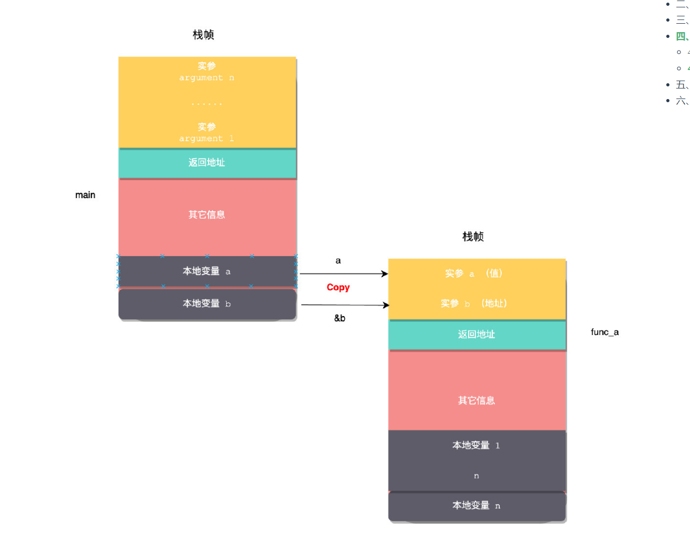

## C++内存管理

### 内存分区
代码段
全局/静态存储区：全局变量; 静态变量
堆
栈
常量区：编译器常量/字面量

### 指针和引用
引用是指针的一个语法糖，在编译器层面当作const指针来使用(常量指针)
指针常量: const int *p;
常量指针: int *const p;

### 值传递、引用传递
本质是拷贝, 不同在传的是值、地址

### RAII
利用栈上局部变量的自动析构来释放资源

### shared_ptr、unique_ptr
shared_ptr: 允许多个指针共享内存, 最后一个指针离开作用域才释放内存
unique_ptr: 只允许一个指针指向内存, 指针离开作用域后释放内存

### shared_ptr的double free问题
1. 声明多个原始指针, 导致每个指针独立计数(采用make_shared解决)
2. 循环引用(采用weak_ptr解决)