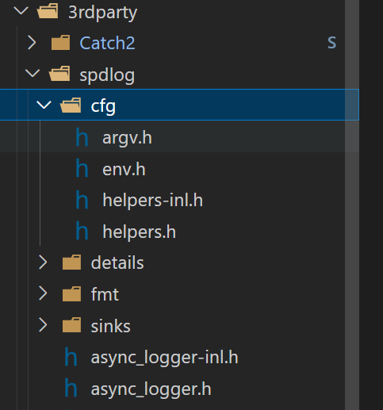
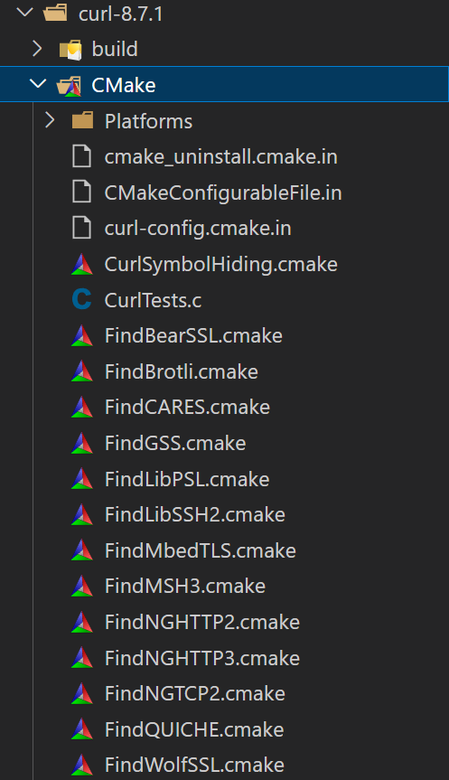

## CMake 学习

### add_subdirectory

添加一个子目录并构建该子目录, project 集成 module

```cmake
add_subdirectory(lib-utils)
add_subdirectory(src)
```

### add_library

用于使用指定的源文件向项目(project)中添加库, 作为 library module

```cmake
aux_source_directory(src UTILS_SRC) // 收集src源码

add_library(utils ${UTILS_SRC}) // 将src源码作为utils库

# 指定库向外部暴露(PUBLIC)的头文件
target_include_directories(utils PUBLIC include)
```

### target_link_libraries

“implementation”, 依赖库文件, 需要 module cmake 配置文件配置为静态库

```cmake
add_executable(HelloCmake ${EXE_SRC})
target_link_libraries(HelloCmake PRIVATE utils) // 该module依赖utils库, 以private私有形式
```

### target_include_directories

“implementation”, 依赖头文件目录, 对比于 target_link_libraries, 不需要 cmake 配置

```cmake
target_include_directories(utils PUBLIC include) // 指定target utils链接库可供外界引用的头文件目录
```

### set_target_properties

todo

### 添加第三方库之 target_include_directories 绝对路径

将指定目录添加为库


```cmake
# 添加spdlog依赖
target_include_directories(HelloCmake PRIVATE ${CMAKE_SOURCE_DIR}/3rdparty)
```

### 添加第三方库之 target_link_libraries + find_packages

#### a.find_packages 做了什么?

寻找第三方库中的 xx.cmake 配置脚本, 然后执行。这说明第三方库的安装应该以 cmake 的方式进行。


```cmake
# 添加curl依赖
find_package(CURL REQUIRED)
target_link_libraries(HelloCmake PRIVATE curl)
```

#### b.find_package 两种 mode 的应用规则

如果 Module 模式搜索失败，没有找到对应的 Find<LibraryName>.cmake 文件，则转入 Config 模式进行搜索；也可通过在 find_package 命令中指定 Config 触发 Config Mode

#### c.非 cmake 支持的官方库

glog 的 cmake 命令

上述命令的核心是 glog 生成了`glog-config.cmake`文件, 可供 find_package config mode 查找, 但是注意需要生成到 find_package 的查找目录中去(一般为/usr/local/lib, 也是默认的安装目录)

参考: https://zhuanlan.zhihu.com/p/97369704

### 添加第三方库之 FetchContent
声明(仓库地址、仓库版本号) + 触发拉取 + 自动配置


## others
解决“cmake: /usr/local/lib/libcurl.so.4: no version information available (required by cmake)”
https://blog.csdn.net/caiexu/article/details/81842888

