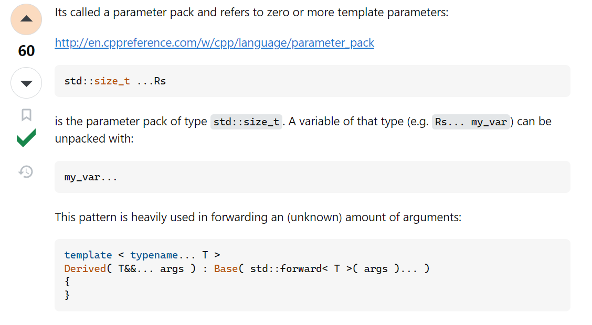

### 线程池

#### 一、c++17 异步操作

1. 使用 packaged_task 包装一个 function, 作为任务

```c++
packaged_task<int(int, int)> func([](int a, int b) { return a + b; });
```

2. 使用 future 返回任务执行结果
   若 future 状态是任务未完成, 则 waiting 线程可去执行其他任务而非等待 future 结果

```c++
auto ret = func.get_future();
```

#### 二、利用完美转发获取可调用对象的函数签名

完美转发 = forward + 引用折叠 + 万能引用

##### a. 左值、右值、move、forward

1. 左值有地址, 右值无地址
2. 对于右值引用使用 std::move，对于万能引用使用 std::forward

参考: https://www.cnblogs.com/shadow-lr/p/Introduce_Std-move.html

##### b. 万能引用

只写一个模板函数即可以接收左值又可以接收右值

```c++
template<typename T>
void func1(T &&param) {
    cout << "refer" << endl;
}
```

参考: https://www.cnblogs.com/shadow-lr/p/Introduce_Std-move.html#%E4%B8%87%E8%83%BD%E5%BC%95%E7%94%A8

##### c. 引用折叠

规定, 形参和实参, 如果任一引用为左值引用，则结果为左值引用。否则（即两个都是右值引用），结果才是右值引用

参考: https://www.cnblogs.com/shadow-lr/p/Introduce_Std-move.html#%E5%BC%95%E7%94%A8%E6%8A%98%E5%8F%A0

##### 引用

https://zhuanlan.zhihu.com/p/369203981
https://www.cnblogs.com/shadow-lr/p/Introduce_Std-move

#### 三、C++函数进化史

函数指针 --> function、 仿函数 + operator() --> lambda

函数指针: 指向函数的指针
function: std::function 是一种函数的包装，可以包装任意的可调用对象; 区别于函数指针, 可能带有闭包。
仿函数 + operator(): 本质是 struct 结构体
lambda: c++语法糖

#### 四、手写一个 std::function

##### a、...

核心概念是参数包, 类型...代表该类型的参数包, 实例...代表解开参数包

参考：https://stackoverflow.com/questions/39792417/what-does-this-three-dots-means-in-c
参考: https://zhuanlan.zhihu.com/p/602560111

#### 五、RAII

#### 六、多线程、线程安全

#### 七、cmake改造版本
./thread-pool
